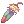
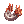
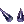
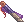
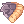
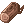
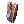
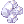

# Adjusted Sale Item Prices

In our server, we have modified the **NPC sell prices** (the price you get when selling items to NPCs) for certain items. This change was made with careful consideration to ensure a more balanced and engaging gameplay experience.

---

## 🛠️ Why We Adjusted Sell Prices

- **Prevent Zeny Inflation**  
  Some items could be farmed and sold in high quantities, leading to rapid inflation in the economy. By adjusting their sell prices, we reduce the chance of players becoming overly wealthy too quickly and destabilizing the market.

- **Encourage Active Gameplay**  
  Instead of farming just one high-selling item repeatedly, players are encouraged to explore different areas, try different builds, and participate in events and instances for more meaningful rewards.

- **Discourage Botting/Exploits**  
  Certain items with high sell prices were being abused by bots. Lowering these prices helps reduce the profitability of automated farming and keeps the server fair for all players.

---

## 🎁 Benefits to Players

- **Healthier Economy**  
  With better control over Zeny sources, the value of items and effort is preserved. This makes trading, buying, and selling more meaningful.

- **More Rewarding Events**  
  With a stable economy, we can offer better rewards through quests, events, and missions without worrying about unbalancing the Zeny flow.

- **Fairer Gameplay**  
  Everyone plays on a level field, reducing the advantage of those who try to abuse item farming or bots.

---

## 📉 Examples of Adjusted Sell Prices

| Item Name         | Original Price | Adjusted Price |
|------------------|----------------|----------------|
| WIND OF VERDURE|500z|250z|
| WITHERLESS ROSE|27500z|13750z|
| HARPY TALON|605z|303z|
| HARPY FEATHER|571z|286z|
| TREASURE BOX|150000z|100000z|
| GOLD|100000z|55000z|
| CRYSTAL MIRROR|7500z|3800z|
| BLOODY RUNE|1008z|650z|
| WHITE MASK|530z|400z|
| SUSPICIOUS HAT|645z|400z|
| DRAGON SKIN|512z|290z|
| DRAGON CANINE|242z|200z|
| DRAGON TAIL|600z|300z|
| DRAGON SCALE|250z|200z|
| BURNING HORSESHOE|411z|300z|
| LITTLE EVIL HORN|264z|200z|
| LITTLE EVIL WING|1000z|500z|
| BURNING HEART|462z|300z|
| LIVE COAL|319z|250z|
| SCORPION CLAW|353z|250z|
| |z|z|
| RED GEM STONE|300z|200z|
| FLAME HEART|1500z|750z|
| GREAT NATURE|1500z|750z|
| CRYSTAL BLUE|1500z|750z|
| RED BLOOD|500z|250z|
| EMPERIUM ANVIL|300000z|150000z|
| GREEN LIVE|500z|250z|
| MYSTIC FROZEN|1500z|750z|
| ROUGH WIND|1500z|750z|
| STILETTO (2),(3),(0)|9750z|4900z|
| KHUKRI|120000z|55000z|
| GOLD RING|15000z|7500z|
| SILVER RING|10000z|5000z|
| YGGBERRY|2500z|1250z|
| MASTELA FRUIT|4250z|2100z|
| PIECE OF CAKE|1500z|750z|
| BLUE POTION|2500z|1250z|
| ROYAL JELLY|3500z|1750z|
| YGGDRASILL SEDD|2500z|1250z|
| DIAMOND RING|22500z|11250z|
| ZARGON|240z|200z|
| CYFAR|386z|300z|
| HARD FEELER|285z|200z|
| DESTROYED ARMOR|521z|300z|
| OLD SHURIKEN|890z|450z|
| BROKEN SWORD|294z|250z|
| MUD LUMP|438z|300z|
| HELM OF DULLAHAN|675z|400z|
| ARMOR PIECE OF DULLAHAN|395z|250z|
| HUNG DOLL|510z|300z|
| DECOMPOSED ROPE|195z|190z|
| WOODEN GNARL|234z|200z|
| STRIPED SOCK|460z|300z|
| BAT CAGE|440z|300z|
| GIANT BUTTERFLY|307z|250z|
| OLD MANTEAU|525z|300z|
| CONTORTED SELF POTRAIT|1016z|508z|
| RUSTY KITCHEN KNIFE|890z|450z|
| RED MUFFLER|330z|250z|
| TANGLED CHAINS|370z|250z|
| PIECE OF BLACK CLOTH|263z|200z|
| BROKEN NEEDLE|345z|250z|
| SPOOL|212z|200z|
| NEEDLE PACKET|416z|300z|
| BLACK BEAR|192z|190z|
| SOLID PEACH|200z|190z|
| STRANGE STEEL PIECE|215z|200z|
| DENTURE FROM DRAGON MASK|218z|200z|
| DRAGON HORN|272z|200z|
| LITTLE GHOST DOLL|605z|400z|
| TURTLE SHELL|340z|250z|
| PEARL|3000z|1500z|
| 3CARAT DIAMOND|27500z|13750z|
| 2CARAT DIAMOND|12500z|6250z|
| 1CARAT DIAMOND|5000z|2500z|
| BROKEN SHELL|450z|300z|
| ICE CUBIC|330z|250z|
| HUUMA WING SHURIKEN|45000z|22500z|
| HUUMA GIANT WHEEL SHURIKEN|20000z|10000z|
| UNDERSHIRT|10000z|5000z|
| RAGAMUFFIN MATEAU|28000z|14000z|
| STAR CRUMB|2250z|1125z|

> *Note: Not all item sell prices have been adjusted. Only high-risk or economy-impacting items were reviewed.*

---

If you have feedback or suggestions regarding sell price changes, feel free to share them in our [Discord Server](#) or community channels!
