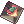
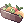
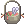
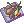

# 🃏 Card Trader

The **Card Trader** allows players to trade unwanted cards for **Points**, which can then be spent at the **Card Trader Shop** to purchase special items.

---

## 🔁 How It Works

Players can exchange cards for points based on their card type. These points can then be used to buy items from the Card Trader Shop.

### 💳 Card-to-Point Conversion

| Card Type    | Points Earned |
|--------------|----------------|
| Normal Card  | 1 Point         |
| Boss Card    | 10 Points       |
| MVP Card     | 50 Points       |

---

## 🛍️ Card Trader Shop

Points can be redeemed in the Card Trader Shop for useful items. Below is an example of available shop items:

| Item Name              | Cost (Points) |
|------------------------|----------------|
|  Life Insurance  | 5 points |
|  Job Battle Manual  | 8 points |
|  Battle Manual  | 8 points |
|  Giant Fly Wing Box 10  | 7 points |
|  Bubble Gum  | 55 points |
|  Gym Pass  | 55 points |
|  Steamed Tongue  | 65 points |
|  Dragon Breath Cocktail  | 65 points |
|  Hwergelmir's Tonic  | 65 points |
|  Cooked Nine Tail's  | 65 points |
|  Stew of Immortality  | 65 points |
|  Steamed Scorpion  | 65 points |
|  Old Card Album  | 95 points |

---

> 💡 **Tip:** Don’t throw away your old cards—trade them in and save up for powerful items!
