# 🕊️ Oathbound Egg Scroll

Sworn under sacred vows and blessed by divine guardians, the **Oathbound Egg Scroll** contains a collection of holy relics and celestial cosmetics. Upon opening it, the following ten blessed costumes will be delivered instantly to your in-game mailbox.

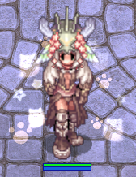{: style="display: block; margin: 0 auto;"}

-    __Lunatic Shawl__

    ---

    **Headgear Costume**  
    *A soft shawl inspired by the beloved Lunatic, radiating gentle warmth.*

    - **Item ID:** #31482
    - **Untradeable**
    - **Visual:** Cute shawl styled after the iconic Lunatic creature
    - **Stats:** Increase Weight Capacity By 50
    - **Preview:** <a href="https://www.divine-pride.net/database/item/31482" target="_blank">Preview Here</a>

    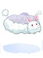{: style="display: block; margin: 0 auto;"}

-   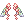 __Fairy Feathers__

    ---

    **Headgear Costume**  
    *Delicate feathers said to have fallen from the wings of forest fairies.*

    - **Item ID:** #31472
    - **Untradeable**
    - **Visual:** Elegant glowing fairy feathers
    - **Stats:** Increase Weight Capacity By 100
    - **Preview:** <a href="https://www.divine-pride.net/database/item/31472" target="_blank">Preview Here</a>

    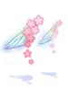{: style="display: block; margin: 0 auto;"}

-   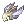 __Helm of Angel__

    ---

    **Headgear Costume**  
    *A sacred helm said to be blessed by celestial guardians.*

    - **Item ID:** #20472
    - **Untradeable**
    - **Visual:** Radiant angelic helmet with holy motifs
    - **Stats:** Increase Weight Capacity By 100
    - **Preview:** <a href="https://www.divine-pride.net/database/item/20472" target="_blank">Preview Here</a>

    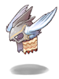{: style="display: block; margin: 0 auto;"}

-   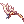 __Valkyrie Feather Band__

    ---

    **Headgear Costume**  
    *A graceful band adorned with the feathers of a Valkyrie.*

    - **Item ID:** #19613
    - **Untradeable**
    - **Visual:** Elegant headband decorated with white feathers
    - **Stats:** Increase Weight Capacity By 50
    - **Preview:** <a href="https://www.divine-pride.net/database/item/19613" target="_blank">Preview Here</a>

    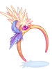{: style="display: block; margin: 0 auto;"}

-   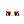 __Blinking Thin Eyes__

    ---

    **Headgear Costume**  
    *A subtle cosmetic that gives your character a calm blinking gaze.*

    - **Item ID:** #31398
    - **Untradeable**
    - **Visual:** Animated thin blinking eye expression
    - **Stats:** Increase Weight Capacity By 100
    - **Preview:** <a href="https://www.divine-pride.net/database/item/31398" target="_blank">Preview Here</a>

    {: style="display: block; margin: 0 auto;"}

-   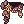 __King Schmidt's Cape__

    ---

    **Garment Costume**  
    *A royal cape worn by the legendary King Schmidt.*

    - **Item ID:** #420069
    - **Untradeable**
    - **Visual:** Regal cape flowing with noble authority
    - **Stats:** Increase Weight Capacity By 200
    - **Preview:** <a href="https://www.divine-pride.net/database/item/420069" target="_blank">Preview Here</a>

    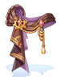{: style="display: block; margin: 0 auto;"}

-    __Valkyrie Circlet__

    ---

    **Headgear Costume**  
    *A sacred circlet symbolizing the blessing of the Valkyries.*

    - **Item ID:** #5909
    - **Untradeable**
    - **Visual:** Elegant circlet with divine wing motifs
    - **Stats:** Increase Weight Capacity By 200
    - **Preview:** <a href="https://www.divine-pride.net/database/item/5909" target="_blank">Preview Here</a>

    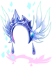{: style="display: block; margin: 0 auto;"}

-    __Straight Long (White)__

    ---

    **Headgear Costume**  
    *A graceful long white hairstyle embodying purity and elegance.*

    - **Item ID:** #31209
    - **Untradeable**
    - **Visual:** Flowing straight white hair
    - **Stats:** Increase Weight Capacity By 200
    - **Preview:** <a href="https://www.divine-pride.net/database/item/31209" target="_blank">Preview Here</a>

    {: style="display: block; margin: 0 auto;"}

-   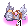 __Valkaria Valkyrie Helm__

    ---

    **Headgear Costume**  
    *A custom Valkaria-themed helm inspired by the legendary Valkyries.*

    - **Item ID:** #41014
    - **Untradeable**
    - **Visual:** Majestic Valkyrie helmet with winged design
    - **Stats:** Increase Weight Capacity By 200
    - **Preview:** <a href="https://www.divine-pride.net/database/item/41014" target="_blank">Preview Here</a>

    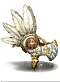{: style="display: block; margin: 0 auto;"}

-    __Spiritual Blessings__

    ---

    **Headgear Costume**  
    *A divine aura that surrounds the wearer with sacred protection.*

    - **Item ID:** #20522
    - **Untradeable**
    - **Visual:** Radiant holy aura effect
    - **Stats:** Increase Weight Capacity By 300
    - **Preview:** <a href="https://www.divine-pride.net/database/item/20522" target="_blank">Preview Here</a>

    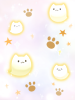{: style="display: block; margin: 0 auto;"}

---

## 📦 Bundle Contents Summary

| Item ID | Costume Name | Type |
| :--- | :--- | :--- |
| #31482 | Lunatic Shawl | Headgear Mid |
| #31472 | Fairy Feathers | Headgear Top |
| #20472 | Helm of Angel | Headgear Top |
| #19613 | Valkyrie Feather Band | Headgear Top |
| #31398 | Blinking Thin Eyes | Headgear Mid |
| #420069 | King Schmidt's Cape | Garment |
| #5909 | Valkyrie Circlet | Headgear Top |
| #31209 | Straight Long (White) | Headgear Top |
| #41014 | Valkaria Valkyrie Helm | Headgear Top |
| #20522 | Spiritual Blessings | Headgear Low |

    <em>All items are costume-only and do not provide game breaking stats. Bound to character upon pickup. Non-tradeable.</em>

