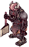
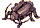
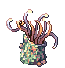
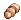
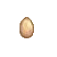
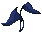
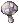
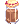

# Poring Coin System

## Summary
The **Poring Coin System** is a special reward system designed to enhance gameplay by offering valuable exchangeable items. Players can obtain **Poring Coins** by hunting specific monsters or completing in-game activities. These coins can be exchanged at designated NPCs for exclusive rewards.

## Content

### Drop Rate
Different monsters have varying drop rates for **Poring Coins**. Below is a breakdown of the drop rates:

- **All monster Drop Rate**: 5% Chance

**Decreased Drop Rate for below Mob**

- 
-  (Thiefbug, Thiefbug Male, Thiefbug Female)
  
**Drop Disable for below Mob**

- 
- 
- 
-  (Green, Red, Shining, White, Blue, Yellow)
- 
- 

> *Note: The drop rates may be subject to change based on future updates.*

### NPC Exchange
Players can exchange their **Poring Coins** for various rewards at the **Poring Merchant NPC**.

#### **NPC Location**:
- **City Name**: Prontera (Main Office)
- **Coordinates**: /navi prt_in 41/103
- **NPC Name**: Poring Coin Trader

#### **Available Items for Exchange**:
| Item Name              | Required Poring Coins |
|------------------------|----------------------|
| Field Manual 50% 	|	 x40  |
| Bubble Gum 	|	 x600  |
| LV10 Blessing Scroll 	|	 x2  |
| LV10 Agi Scroll 	|	 x2  |
| Kafra Card 	|	 x20  |
| Kafra Card 10 Box 	|	 x200  |
| Blessing Scroll 10 Box 	|	 x20  |
| Increase Agility Scroll 10 Box 	|	 x20  |
| Gym Pass 	|	 x70  |
| Giant Fly Wing 50 Box 	|	 x30  |
| Gym Pass 10 Box 	|	 x700  |
| Life Insurance 	|	 x3  |
| Medium Life Potion 	|	 x15  |
| Medium Life Potion 10 Box 	|	 x150  |
| Regeneration Potion 	|	 x15  |
| Regeneration Potion 10 Box 	|	 x150  |
| Tyr's Blessing 	|	 x25  |

> *More items may be added in the future as the system evolves.*

> *Note: The coin is tradeable, can be stored in storage and also can be dropped*

