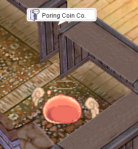
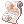
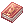
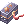
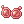
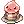
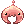

# Poring Coin System

## Summary
The **Poring Coin System** is a special reward system designed to enhance gameplay by offering valuable exchangeable items. Players can obtain **Poring Coins** by hunting specific monsters or completing in-game activities. These coins can be exchanged at designated NPCs for exclusive rewards.

## Content

### Drop Rate
Different monsters have varying drop rates for **Poring Coins**. Below is a breakdown of the drop rates:

- **All monster Drop Rate**: 5% Chance

**Decreased Drop Rate for below Mob**

- 
-  (Thiefbug, Thiefbug Male, Thiefbug Female)
  
**Drop Disable for below Mob**

- 
- 
- 
-  (Green, Red, Shining, White, Blue, Yellow)
- 
- 

> *Note: The drop rates may be subject to change based on future updates.*

### NPC Exchange
Players can exchange their **Poring Coins** for various rewards at the **Poring Merchant NPC**.

#### **NPC Location**:
- **City Name**: Prontera (Main Office)
- **Coordinates**: /navi prt_in 41/103
- **NPC Name**: Poring Coin Trader

#### **Available Items for Exchange**:
| Item Name              | Required Poring Coins |
|------------------------|----------------------|
| Comp Insurance 	|	 x3 Coins  |
| Blessing 10 Scroll 	|	 x5 Coins  |
| Increase Agility 10 Scroll 	|	 x5 Coins  |
| Battle Manual 	|	 x5 Coins  |
| Job Manual 50 	|	 x5 Coins  |
| Medium Life Potion 	|	 x10 Coins  |
| Regeneration Potion 	|	 x10 Coins  |
| Kafra Card 	|	 x15 Coins  |
| Max Weight Up Scroll 	|	 x70 Coins  |
| Bubble Gum 	|	 x600 Coins  |
| Tyr's Blessing 	|	 x55 Coins  |
| Giant Fly Wing (F) 	|	 x55 Coins  |
| Kafra Card Box 	|	 x65 Coins  |
| Blessing 10 Scroll Box 	|	 x50 Coins  |
| Increase Agility 10 Box 	|	 x50 Coins  |
| Max Weight Up Box 	|	 x700 Coins  |
| Medium Life Potion Box 	|	 x100 Coins  |
| Regeneration Box (F) x10 	|	 x100 Coins  |
| Poring Sunglasses (J) 	|	 x150 Coins  |
| Poring Letter 	|	 x150 Coins  |
| Boss Hat 	|	 x165 Coins  |
| Happy Summer Sun Visor 	|	 x170 Coins  |
| Poring Mascot Costume 	|	 x170 Coins  |
| 1st Grade Balloon 	|	 x185 Coins  |
| Poring Traffic Light 	|	 x200 Coins  |
| Angeling Wanna Fly 	|	 x230 Coins  |

> *More items may be added in the future as the system evolves.*

> *Note: The coin is tradeable, can be stored in storage and also can be dropped*

