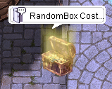

# 👗 Costume Converter Guide

Have extra costumes you don’t need? Convert them into **Valkaria Coins** and make the most out of your wardrobe! This guide explains how the costume conversion system works and how to use the coins you earn.

---

## 🔄 Overview

In **ValkariaRO**, you can recycle unwanted costumes and turn them into valuable **Valkaria Coins**. These coins can be used to:

- 🥚 Purchase **Costume Eggs** (1 Egg = 10 Coins)
- 🪢 Purchase **Capture Rope** (1 Rope - 45 Coin)
- 🧭 Complete certain **custom quests** on the server

---

## 🧍 NPC Location

| NPC Name          | Location     | Function                                                          |
|------------------|--------------|-------------------------------------------------------------------|
| `Costume Converter` | Main Office   | Converts costumes into Valkaria Coins and allows purchase of Costume Eggs |
| `Unidentified Treasure Box` | Prontera 149 157 | Converts costumes received from ValRO Random Box into ValRO Lost Soul and allows to purchase item in the shop |

> 🗺 Use `/navi <map> <x/y>` in-game to find the NPC easily.

---

## 🪙 How It Works

### 🎁 Step-by-Step: Convert Costumes to Coins

1. Talk to the **Costume Recycler** NPC
2. The NPC will automatically scan your inventory for costume items.
3. You will be prompted to input how many costumes you'd like to convert.
4. Each costume will give **1 Valkaria Coin** or **1 ValRO Lost Soul** depending on which NPC you visited.
5. Selected costumes will be removed from your inventory.

> ⚠️ Only cosmetic costumes are eligible. Headgears with stats will not be accepted.

---

### 🥚 Step-by-Step: Buy Costume Egg

1. Talk to the **same NPC** `Costume Converter` or `Unidentified Treasure Box` again.
2. Choose the option **Open Shop** **purchase**.
3. Ensure you have sufficient **Valkaria Coin** or **ValRO Lost Soul**
4. Confirm the purchase and receive your item.

> 🎉 Costume Eggs include a variety of rare and seasonal cosmetics!

---

## 🧾 Notes & Tips

- 🎯 1 Costume = 1 Valkaria Coin/1 ValRO Lost Soul
- 🛠 Valkaria Coins may also be used in **custom quests or events**
- 🧼 Only purely visual costumes are accepted — no stat or functional gears

---

Trade in your excess outfits for something even better — all through the **Costume Recycler** in **ValkariaRO**. Time to clean out that wardrobe! 💃🪙✨
