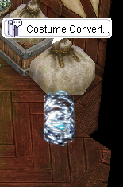

# 👗 Costume Converter Guide

Have extra costumes you don’t need? Convert them into **Valkaria Coins** and make the most out of your wardrobe! This guide explains how the costume conversion system works and how to use the coins you earn.

---

## 🔄 Overview

In **ValkariaRO**, you can recycle unwanted costumes and turn them into valuable **Valkaria Coins**. These coins can be used to:

- 🥚 Purchase **Costume Eggs** (1 Egg = 10 Coins)
- 🧭 Complete certain **custom quests** on the server

---

## 🧍 NPC Location

| NPC Name          | Location     | Function                                                          |
|------------------|--------------|-------------------------------------------------------------------|
| `Costume Converter` | Main Office   | Converts costumes into Valkaria Coins and allows purchase of Costume Eggs |

> 🗺 Use `/navi prt_in 43/95` in-game to find the NPC easily.

---

## 🪙 How It Works

### 🎁 Step-by-Step: Convert Costumes to Coins

1. Talk to the **Costume Recycler** NPC in the **Main Office**.
2. The NPC will automatically scan your inventory for costume items.
3. You will be prompted to input how many costumes you'd like to convert.
4. Each costume will give **1 Valkaria Coin**.
5. Selected costumes will be removed from your inventory.

> ⚠️ Only cosmetic costumes are eligible. Headgears with stats will not be accepted.

---

### 🥚 Step-by-Step: Buy Costume Egg

1. Talk to the **same NPC** (`Costume Recycler`) again.
2. Choose the option to **purchase a Costume Egg**.
3. You’ll need **10 Valkaria Coins** for 1 Egg.
4. Confirm the purchase and receive a random costume.

> 🎉 Costume Eggs include a variety of rare and seasonal cosmetics!

---

## 🧾 Notes & Tips

- 🎯 1 Costume = 1 Valkaria Coin
- 🛠 Valkaria Coins may also be used in **custom quests or events**
- 🧼 Only purely visual costumes are accepted — no stat or functional gears

---

Trade in your excess outfits for something even better — all through the **Costume Recycler** in **ValkariaRO**. Time to clean out that wardrobe! 💃🪙✨
