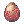

# 🐾 ValRO Pet System

The **ValRO Pet System** allows adventurers to tame monsters as companions that follow, interact, and provide helpful bonuses. Pets can be loyal partners on your journey through Midgard — but they also require care and attention!

---

## 🎀 Overview

Pets are tamed monsters that follow your character around. They can:
- Add **visual flair** and companionship.
- Provide **bonus stats** when loyal.
- Be **evolved** into stronger or rarer versions (if evolution is supported).
- Occasionally **react** or display emotions when hungry, happy, or loyal.

---

## 🧩 How to Obtain a Pet

You’ll need three key components to tame a pet:

| Requirement | Description |
|--------------|-------------|
| **Taming Item** | Used to catch a specific monster (e.g. Poring Taming Item → Poring). |
| **Pet Egg** | Obtained after a successful taming attempt. |
| **Pet Incubator** | Used to hatch your Pet Egg. |

### 🐣 Steps to Tame:
1. Obtain the **Taming Item** for your desired monster.  
2. Use it while facing that monster in battle.  
3. A heart animation will appear — The success rate is unaffected by stats and Provoke, but does increase as target monster health decreased. When the target is at 1% HP the base rate appears to increase by at most 67% (two thirds) multiplicatively  
     - For example, a Rocker has a base tame success rate of 15%. If Rocker is down to 1% HP, the success rate is increased to 25% (15 * 1.67).
     - Having /skillsnap enabled makes targeting the monster easier.
     - Inflicting Bleeding on the monster is a great way to reduce hp to 1 without killing them (e.g. Skogul Card).
4. If successful, you’ll receive a **Pet Egg** in your inventory.  
5. Use a **Pet Incubator** to hatch your new companion.

---

## 💖 Pet Hunger & Intimacy

Your pet has two main stats to manage:

| Stat | Description |
|------|--------------|
| **Hunger** | Drops over time. Keep it fed to prevent it from running away. |
| **Intimacy** | Increases when you feed it properly, decreases if it’s neglected or overfed. |

### 🍖 Feeding Tips:
- Each pet has a **preferred food**. Feeding the correct one increases intimacy.  
- Overfeeding may **lower intimacy** — stop feeding when it says *“I'm full.”*  
- If hunger reaches **0**, the pet may **run away** permanently.  

You can check hunger and intimacy using the **Pet Window** (`Alt + J`).

---

## 🍼 Feeding Type

Different types of pets have different feeding behaviors. Some require manual feeding, while others can use the **Auto-Feed** feature.

| Type | Feeding Method | Example |
|------|----------------|----------|
| **Evolvable Pet** | Only manual feeding. These pets cannot use auto-feed because they can evolve into other forms. | *Poring → Mastering* |
| **Evolved Pet** | Can be auto-fed. Once evolved, these pets can use the auto-feed system. | *Angeling (evolved from Poring)* |
| **Pet Without Evolution** | Can be auto-fed. These pets have no evolution tree. | *Incubus* |

Below is the list of pet that has autofeed enable

| Egg | Egg Name |
|--------------|-------------|
|  | Whisper |
|  | Poporing |
|  | Picky |
|  | Chonchon |
|  | Steel_Chonchon |
|  | Hunter_Fly |
|  | Spore |
|  | Poison_Spore |
|  | Munak |
|  | Sohee |
|  | Dullahan |
|  | Flail_Goblin |
|  | Hammer_Goblin |
|  | Knife_Goblin |
|  | New_Year_Doll |
|  | Goblin_Leader |
|  | Green_Maiden |
|  | Leaf_Cat |
|  | Medusa |
|  | Shinobi |
|  | X-mas_Goblin |
|  | Imp |
|  | Marionette |
|  | Zealotus |
|  | Incubus |
|  | Succubus |

> 💡 **Tip:** To enable auto-feed, open the Pet Window (`Alt + J`) and toggle the *Auto-Feed* checkbox.

---

## 🌟 Pet Loyalty Levels

| Loyalty Level | Intimacy Range | Description |
|----------------|----------------|--------------|
| Awkward | 0–99 | Recently caught or unhappy. |
| Shy | 100–249 | Starting to warm up to you. |
| Neutral | 250–749 | Friendly and calm. |
| Cordial | 750–909 | Likes you! |
| Loyal | 910–1000 | Deeply bonded. Can provide bonuses or evolve. |

---

## 🧠 Pet Bonus Effects

Some pets grant **bonus stats or effects** when they reach *Loyal* status.  
Examples include:
- Poring 🩷 → +1 LUK  
- Deviruchi 😈 → +1 STR  
- Baphomet Jr. ⚔️ → +1 AGI  

> **Note:** Effect is mostly following official stats. Any adjustment on pet stats will be posted below.

---

!!! warning "Work in Progress"
    Pet evolution is yet to be implemented into the server. This is still work in progress.

## 🧬 Pet Evolution System

Certain pets can **evolve** into advanced forms when they reach *Loyal* status and meet specific requirements.

### 🔹 Evolution Requirements:
- The pet must be **Loyal**.
- You must have the **Evolution Item** (varies per pet).
- Some pets may require special materials or zeny.

Evolution can:
- Change your pet’s **appearance**.
- Enhance its **stat bonuses**.
- Unlock **new abilities** (for supported pets).

> Example: *Lunatic → Angeling (via Angelic Essence)*

---

## ⚠️ Important Notes
- Pets cannot be traded or dropped once hatched.  
- Some pets may not be available depending on server settings.  
- If your pet runs away, it **cannot be recovered**, so keep it happy!  

---

## 🏡 Future Expansion

The ValkariaRO team plans to add more **custom pets**, **unique taming items**, and **special evolutions** in future updates. Stay tuned to our [Discord Announcements](https://discord.gg/valkaria) for upcoming pet content!

---

