!!! note 
    The page still under contruction, all new details will be added in future

Here’s a quick note on **Endless Cellar Dungeon Instance** in our server:  

### **Endless Cellar Dungeon Instance** 
 
**Overview**

Endless Cellar is one of the most popular instances in Ragnarok Online, designed for team-based gameplay. It is part of the so-called "endless" instances, offering players a challenge in the form of a series of dungeons filled with increasingly powerful monsters, mini-bosses, and mighty MVPs. This is not only an engaging PvE experience but also a place where players can earn valuable rewards and test their skills in teamwork. It’s a perfect challenge for guilds and friends who aim to overcome obstacles together. The Cellar is always ready to challenge those seeking adventure in the world of Ragnarok Online.  

### **Instance Mechanics:**

    -  All party members must be present on Misty Island at the time the Party Leader clicks to stone to initiate the dungeon start.
    -  Any member who attempts to join an in progress party will automatically be kicked out of the instance.
    -  Original members of the party may leave the dungeon and re-enter as long as a member is still active within the dungeon (If all members exit, the instance will be deleted and cooldown commences)
    -  Create a party and run Solo or with a party of up to 12 total people (11+1) Dungeon instance creation starts at lowest level completed out of all party members
    -  Experience and loot and obtained per kill and will be issued depending on party share options
    -  Bubble Gum and EXP manuals do not effect drop rate and/or exp rates
    -  Loot/EXP is accounted based
    -  Level 85+ to enter
    -  Monsters remaining per floor will be announced starting with 5 remaining

### **Schedule**
  
    -  Endless Cellar weekly cooldown (6 days, 16 hours) 

### **How to start Instance**
 
    -  To start the instance, you need to talk to Captain Janssen in Prontera (/navi Alberta 215/76 ). Talk to him a few times. The journey to Misty Island costs 10,000 Zeny. On the island, talk to the Cellar Protection Stone and select Enter Endless Cellar

### **Monster list:**

| Floor Level | Monster |  
|---|---|
| Floor 1 |  Fabre 20x   Picky 10x   Picky 10x |
| Floor 2 | 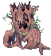 Willow 10x   Wolf 10x   Creamy 10x |
| Floor 3 | 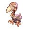 Condor 10x   Peco Peco 10x   Muka 10x |
| Floor 4 |  Greatest General 25x   Eddga 1x |
| Floor 5 |  Spore 15x   Poison Spore 15x |
| Floor 6 |  Crab 15x   Shellfish 15x   Aster 15x |
| Floor 7 | 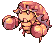 Vadon 10x  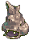 Cornutus 10x   Marina 10x   Plankton 10x |
| Floor 8 |  Garm Baby 10x   Marine Sphere 20x   Garm 1x |
| Floor 9 |  Metaller 20x   Magnolia 20x |
| Floor 10 |  Coco 15x   Caramel 15x   Horn 15x |
| Floor 11 |  Orc Warrior 25x   Eggyra 25x |
| Floor 12 | 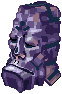 Megalith 10x  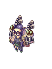 Panzer Goblin 10x   Rotar Zairo 10x   Steam Goblin 10x   Tao Gunka 1x |
| Floor 13 |  Smokie 15x   Giearth 15x   Martin 15x   Raggler 15x |
| Floor 14 |  Worm Tail 25x   Stem Worm 25x |
| Floor 15 |  Christmas Jakk 10x   Christmas Goblin 10x   Christmas Cookie 10x   Cookie 10x   Christmas Orc 10x |
| Floor 16 |  Antonio 25x   Santa Poring 25x   Stormy Knight 1x |
| Floor 17 |  Roda Frog 10x   Thara Frog 10x   Poison Toad 10x   Toad 1x |
| Floor 18 |  Lunatic 20x   Spring Rabbit 20x   Eclipse 1x |
| Floor 19 |  Yoyo 20x   Mime Monkey 20x   Choco 1x |
| Floor 20 |  Ghoul 10x   Myst 10x   Vitata 10x   Zenorc 10x   Dracula 1x |
| Floor 21 | 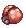 Stainer 30x   Brilight 20x |
| Floor 22 |  Marc 15x   Tri Joint 15x   Fur Seal 15x   Sea Otter 15x |
| Floor 23 |  Wood goblin 20x  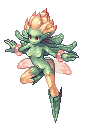 Les 20x   Mavka 10x |
| Floor 24 |  Babayaga 20x   Uzhas 10x  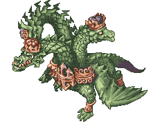 Gopinich 1x |
| Floor 25 |  Kaho 15x   Blazzer 15x   Driller 15x   Horong 10x   Minorous 5x |
| Floor 26 |  Dokebi 30x   Am Mut 20x   Sageworm 10x |
| Floor 27 |  Savage 30x   Gullinbursti 20x   Goat 10x |
| Floor 28 |  Beetle King 20x   Bacsojin 10x   Chung E 10x   Tamruan 30x  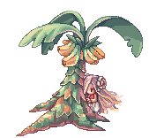 Lady Tanee 1x |
| Floor 29 |  Requiem 25x   Zerom 25x   Skeleton General 10x |
| Floor 30 |  Leaf cat 25x   Wild Rose 25x |
| Floor 31 |  Dustiness 10x   Giant Spider 10x   Porcellio 10x   Pitman 10x |
| Floor 32 |  Mineral 10x   Waste Stove 10x   Noxious 10x  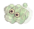 Venomous 10x   Teddy Bear 10x   RSX-006 1x |
| Floor 33 |  Bathory 15x   Sohee 15x   Violy 15x |
| Floor 34 | 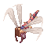 Dragon Tail 15x   Geographer 15x  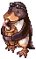 Galapago 15x   Kapha 15x |
| Floor 35 |  Rice cake boy 15x   Boiled Rice 15x   Baby Leopard 15x |
| Floor 36 |  Disguise 30x   Dark Priest 20x  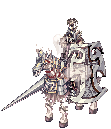 Lord of Death 1x |
| Floor 37 |  Wootan Shooter 25x   Wootan Fighter 25x |
| Floor 38 |  Mole 30x  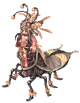 Maya Purple 10x |
| Floor 39 |  Safeguard Chief 10x  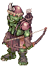 Orc Sniper 10x   Depraved Orc Spirit 10x   Shaman Cargalache 10x |
| Floor 40 |  Magmaring 15x   Knocker 15x   Imp 15x |
| Floor 41 |  Remover 25x   Gemini-S58 25x |
| Floor 42 |  Breeze 25x   Roween 25x |
| Floor 43 |  Gremlin 25x   Hodremlin 25x |
| Floor 44 |  Novus 25x   Acidus 25x   Detale 1x |
| Floor 45 |  Banshee Master 25x  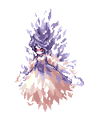 Banshee 25x |
| Floor 46 | 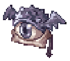 Beholder Master 25x   Beholder 15x   Seeker 15x |
| Floor 47 |  Cobalt Mineral 25x   Heavy Metaling 25x |
| Floor 48 |  Alicel 30x   Constant 30x   Kiel D-01 1x |
| Floor 49 | 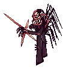 Frus 50x |
| Floor 50 |  Hell Apocalips 25x   Apocalips 25x |
| Floor 51 | 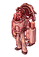 Zakudam 25x   Archdam 25x |
| Floor 52 |  Aunoe 25x   Fanat 25x   Gloom Under Night 1x |
| Floor 53 |  Zombie Slaughter 25x   Hell Poodle 25x |
| Floor 54 |  Siroma 30x   Snowier 20x   Ice Titan 10x |
| Floor 55 |  Iceicle 75x |
| Floor 56 |  Gazeti 30x   Ktullanux 1x |
| Floor 57 |  Photon Cannon 10x   Photon Cannon 10x   Photon Cannon 10x   Photon Cannon 10x   Vesper 1x |
| Floor 58 |  Ghostring 3x   Angeling 3x   Deviling 3x   Arc Angeling 3x   Mastering 3x |
| Floor 59 |  Thanatos Odium 12x   Thanatos Despero 12x   Thanatos Maero 12x   Thanatos Dolor 12x |
| Floor 60 |  Thanatos Phantom 1x|
| Floor 61 |  Pinguicula 40x  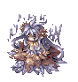 Dark Pinguicula 40x |
| Floor 62 | 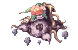 Nepenthes 60x   Luciola Vespa 30x |
| Floor 63 |  Naga 50x   Cornus 20x |
| Floor 64 | 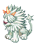 Hillslion 15x   Tendrillion 2x |
| Floor 65 |  Centipede Larva 50x   Centipede 25x |
| Floor 66 |  Draco Egg 30x   Draco 10x   Tatacho 40x |
| Floor 67 |  Bradium Golem 30x   Stalactic Golem 10x   Lava Golem 20x |
| Floor 68 |  Tatacho 10x   Hardrock Mammoth 2x |
| Floor 69 |  Aqua Elemental 25x   Rhyncho 25x   Phylla 25x |
| Floor 70 | 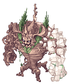 Ancient Tree 35x   Dark Shadow 15x |
| Floor 71 |  Rata 12x   Duneyrr 12x |
| Floor 72 | 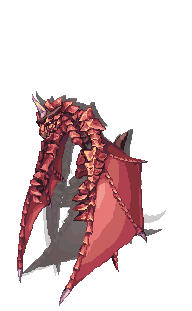 Nidhoggr's Shadow 1x |
| Floor 73 |  Byorgue 16x |
| Floor 74 |  Lord Knight Seyren 2x   Assassin Cross Eremes 2x   Whitesmith Howard 2x   High Priest Margaretha 2x   Sniper Cecil 2x   High Wizard Kathryne 2x |
| Floor 75 |  Incarnation of Morroc 7x  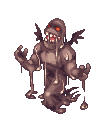 Incarnation of Morroc 7x   Incarnation of Morroc 7x   Incarnation of Morroc 7x |
| Floor 76 |  Wounded Morroc 1x |
| Floor 77 (Final Floor Stage 1) |  Poring 1x |
| Floor 77 (Final Floor Stage 2) |  Lord Knight Seyren(MVP) 1x   Assassin Cross Eremes(MVP) 1x   Whitesmith Howard(MVP) 1x   High Priest Margaretha(MVP) 1x   Sniper Cecil(MVP) 1x   High Wizard Kathryne(MVP) 1x |
| Floor 77 (Final Floor Stage 3) |  Super Baphomet 1x   Piamette 2x   Wish Maiden 2x |
| Floor 77 (Final Floor Stage 4) |  Pori Pori 1x   Golden Savage 10x   Pouring 10x   Bomb Poring 20x  |
