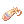
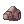
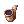
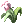
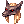
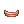
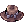
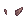
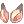
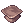

!!! note 
    The page still under contruction, all new details will be added in fuuture

Here’s a quick note on **Headgear Quests** in our server:  

### **Title Headgear Quest System**  
**Purpose:**  
- Players complete quests to earn unique headgears with special titles.  
- Titles appear in the item description or as part of the headgear’s name.  

### **Quest Mechanics:**  
1. **NPC Location** – NPC Quest Master in Main Office (/navi prt_in 44/101).

2. **Quest Types:**   
    -  Gathering – Collect items (e.g., 1000 Jellopies for "Jelly King").  
    -  Instance Completion – Finish dungeons or boss fights. (Coming Soon)  

3. **Rewards:**  
    -  Unique **Headgear** with a official **stats**.  

### **Available Quest:**  
| Headgear | Description |Quest Requirement |  
|---|---|---|
|  Pecopeco_Hairband | Reduce after attack delay 5%   Reduces variable cast time 5%   Increase movement speed    Defense: 3   Position: Upper   Weight: 0   Level Requirement: 1   Jobs: All |  Poring_Coin 160x   Detrimindexta 50x   Alcohol 50x   Karvodailnirol 50x   PecoPeco_Feather 550x      3500000z |
|  Sigrun's_Wings | Merchant, Thief or Taekwon class, STR+1   Acolyte, Ninja or Soul Linker class, INT+1   Archer or Gunslinger class, DEX+1    Defense: 2   Position: Middle   Weight: 10   Level Requirement: 30   Jobs: All |  Poring_Coin 160x   Detrimindexta 50x   Alcohol 50x   Karvodailnirol 50x   Moth_Wings 400x   Indian_Fillet 1x    3500000z |
|  Robo_Eyes | DEX+1   ATK+2%   MATK+2%    Defense: 1   Position: Middle   Weight: 20   Level Requirement: 10   Jobs: All |  Poring_Coin 160x   Detrimindexta 50x   Alcohol 50x   Karvodailnirol 50x   Binoculars 1x   Star_Dust 400x    3500000z |
|  Snake_Head | Enable use LVL5 Double Attack    Defense:1   Position: Upper   Weight: 20   Level Requirement: 30   Jobs: All |  Poring_Coin 160x   Detrimindexta 50x   Alcohol 50x   Karvodailnirol 50x   Snake_Scale 350x   Elastic_Band 350x    3500000z |
|  Angel_Spirit | HIT+15   STR+2    Defense: 0   Position: Middle   Weight: 20   Level Requirement: 30   Jobs: All |  Poring_Coin 160x   Detrimindexta 50x   Alcohol 50x   Karvodailnirol 50x   Evil_Horn 200x   Emperium 2x   Steel 50x  3500000z |
|  Candy_Cane_in_Mouth | MaxSP+5    Defense: 0   Position: Lower   Weight: 10   Level Requirement: 1   Jobs: All |  Poring_Coin 160x   Candy_Cane 700x   Roda_Frog_Card 1x   Oil_Paper 50x        3500000z |
|  Gangster_Scarf | ATK+5   Rogue Class, Enable LVL1 Ganster Paradise    Defense: 0   Position: Lower   Weight: 10   Level Requirement: 60   Jobs: All except Novice |  Poring_Coin 160x   Andre_Card 1x   Red_Scarf 1x   Red_Bijou 400x        3500000z |
|  Chocolate_Donut | MAX HP+100   Recover 1 HP every 10s    Defense: 0   Position: Lower   Weight: 5   Level Requirement: 1   Jobs: All |  Poring_Coin 160x   Sticky_Mucus 700x   Pupa_Card 1x   Nursing_Bottle 30x        3500000z |
|  Ninja_Scroll | AGI+1   Increase movement speed 1%    Defense: 0   Position: Lower   Weight: 20   Level Requirement: 40   Jobs: All |  Poring_Coin 160x   Worn_Out_Scroll 350x   Oxygen_Mask 1x   Iron_Cain 1x        3500000z |
|  Rainbow_Scarf | MATK+1%   INT+1    Defense: 1   Position: Lower   Weight: 10   Level Requirement: 40   Jobs: All |  Poring_Coin 160x   Gangster_Mask 1x   Rainbow_Shell 700x   Darkgreen_Dyestuffs 3x        3500000z |
|  Well-Chewed_Pencil | HIT+3   DEX+1    Defense: 0   Position: Lower   Weight: 10   Level Requirement: 10   Jobs: All |  Poring_Coin 160x   Pencil_Case 3x   Angry_Snarl 1x   Fine-grained_Trunk 700x        3500000z |
|  Evolved_Pipe | STR+1   Atk+1    Defense: 0   Position: Lower   Weight: 10   Level Requirement: 1   Jobs: All except Novice  |  Poring_Coin 160x   Cigarette 1x   Maneater_Root 700x   Matchstick 1x        3500000z |
|  Evolved_Leaf | VIT+1   Plant monster resistance +3%    Defense: 0   Position: Lower   Weight: 10   Level Requirement: 1   Jobs: All except Novice |  Poring_Coin 160x   Romantic_Leaf 1x   Sharp_Leaf 500x   Hinalle 30x        3500000z |
|  Crimson_Rose | LUK+1   CRIT+1    Defense: 0   Position: Lower   Weight: 10   Level Requirement: 40   Jobs: All |  Poring_Coin 160x   Four_Leaf_Clover 1x   Witherless_Rose 50x   Romantic_Flower 1x        3500000z |
|  Chewing_Gum | Increase Base EXP & Job EXP by 5%    Defense: 0   Position: Lower   Weight: 1   Level Requirement: 1   Jobs: All |  Poring_Coin 160x   Bubble_Gum 1x   Battle_Manual 1x   Oil_Paper 100x   Sticky_Mucus 500x      3500000z |
|  Anubis_Helm | MDEF+ 5   Reduce BOSS DMG 13%   Increase restoration from Healing skill & items by 12%    Defense: 8   Position: Upper   Weight: 0   Level Requirement: 50   Jobs: All |  Poring_Coin 200x   Treasure_Box 35x   Old_Magic_Book 100x   Sphinx_Hat 1x        7500000z |
|  Cyclop's_Eye | MaxSP +50    Defense: 0   Position: Middle   Weight: 20   Level Requirement: 75   Jobs: All except Novice |  Poring_Coin 150x   Old_White_Cloth 800x   Zorro_Mask 1x   Ancient_Mimic_Card 1x   Monkey_Circlet 1x      7500000z |
|  Captain's_Hat | Physical Ranged Atk + 7%   MaxHP+100  DEX+1    Defense: 3   Position: Upper   Weight: 30   Level Requirement: 50   Jobs: All |  Poring_Coin 150x   Soft_Feather 550x   Rocker_Card 1x   Antlers 1x   Corsair 1x      7500000z |
|  Wickebine's_Black_Cat_Ears | CRIT DMG+10%   CRIT+3   FLEE+10   DEF-50%    Defense: 2   Position: Upper   Weight: 20   Level Requirement: 45   Jobs: All |  Poring_Coin 150x   Black_Cat_Doll 275x   Black_Cat_Ears 1x   Spiky_Band 1x        5500000z |
|  Magic_Eyes | INT+3   MDEF+5   Reduce casting time by 7%   Increase SP consumption 12%   Reduce DMG Undead & Demon by 2%   MaxSP+100    Defense: 1   Position: Upper   Weight: 3   Level Requirement: 30   Jobs: Mage & Soul Linker |  Poring_Coin 150x   Eye_of_Dullahan 1x   Magician_Hat 1x   Coronet 1x        5500000z |
|  Close_Helmet | VIT+3   MaxHP+3%   Resistance to fire 3%    Defense: 8   Position: Upper   Weight: 120   Level Requirement: 75   Jobs: Swordman Class |  Poring_Coin 150x   Helm 1x   Goibne's_Helm 1x   Mr._Scream 1x   Iron_Cain 1x      5500000z |
|  Helm_of_Darkness | STR+2   INT+1   Resistance to Blind 5%    Defense: 3   Position: Upper & Middle   Weight: 50   Level Requirement: 50   Jobs: Swordman, Merchant and Thief class |  Poring_Coin 150x   Deviruchi_Card 1x   Deviruchi_Hat 1x   Will_of_the_Darkness 120x        5500000z |
|  Alice_Doll | STR+1   Demi-Human DMG +10%   Low chance to inflict sleep on wearer when attacking    Defense: 0   Position: Upper   Weight: 50   Level Requirement: 30   Jobs: All except Novice |  Poring_Coin 150x   Marionette_Doll 1x   Osiris_Doll 1x   Alice's_Apron 225x        5500000z |
|  Purple_Cowboy_Hat | INT+2   VIT+2   MaxSP+50    Defense: 4   Position: Upper   Weight: 50   Level Requirement: 1   Jobs: All |  Poring_Coin 150x   Sweet_Gent 1x   Elder_Willow_Card 1x   Willow_Card 1x   Necklace 1x   Golden_Gear 1x   Violet_Dyestuffs 5x  5500000z |
|  Rideword_Hat | Randomly absorb 5% physical damage inflicted into HP   Randomly absorb 2% physical damage inflicted into SP   Drain 10 HP every 5s while equipped    Defense: 2   Position: Upper   Weight: 30   Level Requirement: 60   Jobs: All |  Poring_Coin 50x   Rideword_Card 1x   Hunter_Fly_Card 1x   Book_of_Billows 1x   Book_of_Mother_Earth 1x   Book_of_Blazing_Sun 1x   Book_of_Gust_of_Wind 1x  2000000z |
|  Mischievous_Fairy | AGI+2   Enable Teleport LVL1    Defense: 1   Position: Middle   Weight: 20   Level Requirement: 35   Jobs: All |  Poring_Coin 100x   Elven_Ears 1x   Creamy_Card 1x   Kukre_Card 1x   Giant_Butterfly_Wing 400x      5000000z |
|  Fish_in_Mouth | Increase 65% of recovery rate of Fresh Fish    Defense: 0   Position: Lower   Weight: 20   Level Requirement: 30   Jobs: All |  Poring_Coin 50x   Blue_Fish 1x   Sharp_Scale 350x   Fish_Tail 100x        1500000z |
|  Modified magistrate hat | AGI+1   HP Regen +3%   CRIT DMG +7%   CRIT+20   Delay after ATK +5%    Defense: 3   Position: Upper   Weight: 40   Level Requirement: 60   Jobs: Taekwon or Taekwon Master |  Poring_Coin 150x   Magistrate_Hat 1x   Red_Silk_Seal 1x   Soldier_Skeleton_Card 1x        3000000z |
|  Improved Cowboy Hat | HIT+15   CRIT+10   ATK+20    Defense: 5   Position: Upper   Weight: 50   Level Requirement: 1   Jobs: Gunslinger |  Poring_Coin 150x   Cowboy_Hat 1x   Mummy_Card 1x   Andre_Card 1x   Spoon_Stub 70x      3000000z |
|  Modified_Binoculars | DEX+1   Long Range ATK+1%    Defense: 1   Position: Middle   Weight: 10   Level Requirement: 45   Jobs: Hunter, Bard, Dancer & Gunslinger |  Poring_Coin 150x   Binoculars 1x   Alcohol 25x   Pyroxene 5x   Star_Dust 250x      2500000z |
|  Pendant Of Stealing | VIT+2   Chances to steal Zeny from monsters when defeated    Defense: 0   Position: Accessory Type Armor   Weight: 0   Level Requirement: 50   Jobs: All except Alchemist & Creator |  Poring_Coin 150x   Necklace 1x   Joker_Card 1x   Little_Evil_Wing 270x   Amethyst 3x      3500000z |
|  Blood Admiral's Hat | Increase resistance from Demi-Human by 10%   VIT+1   HP+100   MDEF+5    Defense: 1   Position: Upper   Weight: 50   Level Requirement: 95   Jobs: All |  Poring_Coin 50x   Corsair 1x   Feather Beret 1x   Red_Bonnet 1x   Alarm_Card     2500000z |
|  Peacock Feather | INT+2   After Cast Delay -12%   Variable Casting Time +7%    Defense: 4   Position: Upper   Weight: 80   Level Requirement: 1   Jobs: All except Mage |  Poring_Coin 70x   Crown 1x   Expert_Ring 2x   Phen_Card 1x   PecoPeco_Feather 500x      3000000z |
|  Angel_Earrings | INT+2   Enable Teleport LVL1    Defense: 5   Position: Middle   Weight: 10   Level Requirement: 35   Jobs: All |  Poring_Coin 90x   Elven_Ears 1x   Earring 1x   Creamy_Card 1x   Crystal_Fragment 400x      5000000z |
|  Black_Elven_Ears | STR+2   Enable Teleport LVL1    Defense: 2   Position: Middle   Weight: 20   Level Requirement: 35   Jobs: All |  Poring_Coin 90x   Elven_Ears 1x   Tarou_card 1x   Creamy_Card 1x   Dark_Crystal_Fragment 400x      5000000z |
 Ancient_Elven_Ears | DEC+2   Enable Teleport LVL1    Defense: 2   Position: Middle   Weight: 20   Level Requirement: 35   Jobs: All |  Poring_Coin 90x   Elven_Ears 1x   Creamy_Card 1x   Wormtail_Card 1x   Bacillus 400x      5000000z
 Antique_Smoking_Pipe | Reduce DMG from Demi-Human 2%    Defense: 0   Position: Lower   Weight: 10   Level Requirement: 1   Jobs: All |  Poring_Coin 250x   Pipe 1x   Detrimindexta 60x   Alcohol 60x   Maneater_Root 500x      2500000z
 Dark_Randgris_Helm | DEX+3   STR+2   MDEF+3   HIT+20   FLEE-25    Defense: 2   Position: Upper   Weight: 30   Level Requirement: 1   Jobs: All |  Poring_Coin 200x   Angel_Spirit 1x   Bone_Helm 1x   Willow_Card 1x   Valhala's_Flower 2x   Black_Dyestuffs 3x    3000000z
 Evil_Snake_Lord_Hat | STR+2   INT+3   AGI+2   Increase DMG received from Shadow, Undead & Holy by 30%    Defense: 2   Position: Upper   Weight: 80   Level Requirement: 60   Jobs: All |  Poring_Coin 280x   Ph.D_Hat 1x   Taeguk_Plate 5x   Deviruchi_Card 1x   Nightmare_Card 1x   Scarlet_Dyestuffs 1x    3000000z

