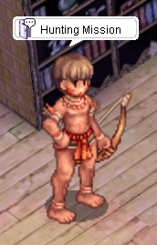

# Monster Hunting System

## Summary

The **Monster Hunting System** is a rewarding gameplay feature where players can hunt specific monsters to earn valuable rewards. This system encourages exploration and combat, providing incentives for players to defeat designated monsters and claim their prizes.

## Content

#### **Quest NPC Location**:
- **City Name**: Prontera (Main Office)
- **Coordinates**: `/navi prt_in 39/113`
- **NPC Name**: Hunting Mission

Below are the quick notes on the restriction.

- Mission available to player level 80 and higher.
- Mission conditions may be reset as many times as desired, with each reset costing 150,000 zeny.
- Only one mission can be completed every 12 hours.
- Missions can only be taken on one character per account.
- Monsters that are killed by your party members within your screen view will be counted as being killed by you.

### Shop List

Hunting points can be used to claim below reward

| Reward Item  | Points Required           |
|--------------|----------------------|
|  Convex Mirror  | 7 points |
|  Speed Potion  | 3 points |
|  Convex Mirror 10pc box  | 70 points |
|  Speed Potion box 10pc  | 30 points |
|  Enriched Elunium 5 Box  | 250 points |
|  Enriched Oridecon 5 Box  | 250 points |
|  Taming Gift Set  | 34 points |
|  Jewelry Box  | 500 points |
|  Costume Happy Peace Proof  | 150 points |
|  Costume Watermelon Hat  | 150 points |
|  Costume Pumpkin Toque  | 150 points |
|  Costume Green Hat  | 150 points |
|  Costume Apple Of Archer  | 150 points |
|  Costume Hunting Cap  | 150 points |

> *Note: Points required and rewards may be adjusted in future updates.*

### Conclusion

The **Monster Hunting System** provides an exciting challenge for players looking to test their skills and earn rewards. Visit the **Monster Hunting NPC** in Prontera to accept hunting quests and start your journey!

