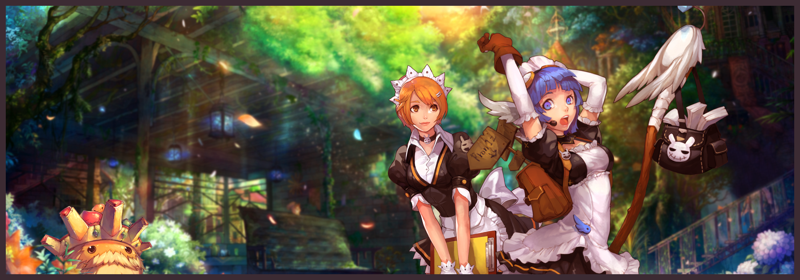

---

---

!!! note 
    Official Launch on 26th April 10AM +8 GMT!! Register your account and download our client
<br>

# Welcome to **VALKARIA**, Adventurers!

We are thrilled to have you join **ValRO**, a  server dedicated to delivering an exciting, fair, and engaging gaming experience. Whether you're a veteran or a new player, our server provides a balanced gameplay environment, customized features, and a supportive community to ensure you have the best time possible.

<!-- [Register Now](#){ .md-button .md-button--primary } -->

{ loading=lazy }

----------------------------------------------

## Everything you would expect
<div class="grid cards" markdown>

-    <p class="custom-feature"> :material-bike-fast:{.icon} **Stable & Lag-Free Server**</p>
    
    Enjoy smooth gameplay with minimal downtime.  
    
-   <p class="custom-feature"> :fontawesome-solid-scale-balanced:{.icon} **Balanced Rates & Fair Economy**</p>

    We ensure a sustainable and rewarding player-driven market.  

-   <p class="custom-feature"> :material-robot-excited:{.icon} **Exciting Custom Content**</p>

    Unique quests, maps, and events tailored for our community.  

-   <p class="custom-feature"> :simple-internetcomputer:{.icon} **Active Development & Support**</p>

    Our dedicated team constantly updates and maintains the server.  

-   <p class="custom-feature"> :material-cash-off:{.icon} **Fair Play Server**</p>

    Cash shop is focused on Customes only and any headgear in cash shop can be obtainable via quest.

-   <p class="custom-feature"> :fontawesome-solid-people-group:{.icon} **Competitive Gameplay**</p>

    Join a friendly and active community with thrilling PvP, WoE, and cooperative events that keep the game exciting for everyone!

</div>

!!! Changelogs

    === "Jan 2025 V2.7b"
    
        ``` markdown 
        - New Job Change Pack
        - Pet Evolution is Live!
        ```
            [View Full Dec Changelog](changelog/20jan26-change-log.md)

    === "Jan 2025 V2.7a"
    
        ``` markdown 
        - Newbie Gift and Bug Update
        - NPC and System Fix
        - Equipment Re-adjustments
        - Party EXP System Overhaul
        ```
            [View Full Dec Changelog](changelog/6jan26-change-log.md)

    === "Dec 2025"
    
        ``` markdown 
        - Item Updates
        - Halter NPC Adjustments
        - ValRO RandomBox Costume Converter
        - Server Performance Tweaks
        ```
            [View Full Dec Changelog](changelog/dec2-change-log.md)

    === "Dec 2025"
    
        ``` markdown 
        - Horror Toys Factory
        - Mob Adjustment
        - KoE Adjustment
        - Bug Fixes
        ```
            [View Full Dec Changelog](changelog/dec-change-log.md)

    === "Nov 2025"
    
        ``` markdown 
        - Mystery Market
        - Hunting Mission
        - Mechomatrix
        - Bug Fixes
        ```
            [View Full Nov Changelog](changelog/nov-change-log.md)


    === "Oct 2025"

        ``` markdown 
        - Costume Update
        - Poring Coin Update
        - Gift Box Update
        - Bug Fixes
        ```
            [View Full Oct Changelog](changelog/oct-change-log.md)

    === "Sept 2025"

        ``` markdown 
        - Warper Update
        - Vending Commands
        - New Egg Scroll
        - Bug Fixes
        ```
            [View Full Sept Changelog](changelog/sept-change-log.md)

    === "Apr 2025 v1.3"

        ``` markdown 
        - Healer Readjustment
        - Blue Potion in Tool Dealer
        - Training Ground Rework
        - Equipment Fixes
        ```
            [View Full Apr Changelog](changelog/apr-change-log4.md)

    === "Apr 2025 v1.2"

        ``` markdown 
        - Healer Readjustment
        - Blue Potion in Tool Dealer
        - Training Ground Rework
        - Equipment Fixes
        ```
            [View Full Apr Changelog](changelog/apr-change-log3.md)            

    === "Apr 2025 v1.1"

        ``` markdown 
        - Quest
        - NPC
        - Item
        - CBT
        ```
            [View Full Apr Changelog](changelog/apr-change-log2.md)

    === "Apr 2025 v1.0"

        ``` markdown 
        - Healer Buff
        - Shop Price
        - Card Remover
        - Daily Freebies Adjustment
        ```
            [View Full Apr Changelog](changelog/apr-change-log.md)

    === "Mar 2025"

        ``` markdown 
        - Server Development
        ```
            [View Full Changelog](change-log.md)

## Main Features

<div class="grid cards" markdown>

-   **Repeatable Quest**
   
    
    Kill a monster, collect specific item to earn EXP rewards ingame. Item requirement is tradeable has value<br>
    [Learn More](daily-quest.md)

-   **Hunting Mission**
   
    
    Take on monster-slaying quests and earn valuable rewards<br><br>
    [Learn More](hunting-mission.md)

-   **Coins System**
   
    
    Special Coins which earned through various in-game content and events. Can be use for quest headgear or in-game shop exchange.<br>
    [Learn More](coin-system.md)

-   **Headgear Quest**
   
    
    Players complete quests to earn unique headgears with special titles..<br>
    [Learn More](headgear-quest.md)

-   **Warper Quest**
   
    
    Warper NPC which provide service to teleport to dungeon..<br>
    [Learn More](warper-quest.md)

-   **Random Option**
   
    
    Equipment drop has extra random stats base on equipment level<br>
    [Learn More](random-option.md)
</div>

## Extra Features

<div class="grid cards" markdown>
   
-   
    
    [Card Trader](card-trader.md)<br>
    [Valkaria MVP Features](mvp-features.md)<br>
    [Adjusted Item Price](adjusted-price.md)<br>
    [Healer](healer.md)<br>
    [Mystery Market](mysterymarket.md)<br>
    [Halloween Event](halloween.md)<br>
    [The Mechromatrix Protocol Quest](mecho.md)<br>
    [Horror Toy Factory](horrortoyfactory.md)<br>
    [King of Emperium](koe.md)

- 

    [Vendor System](vendor.md) <br>
    [Marketplace System](marketplace.md) <br>
    [Costume Converter](costume-converter.md)<br>
    [Endless Cellar](endless-cellar.md)<br>
    [Pet System](cute-pet.md)<br>
    Battleground (Coming Soon)<br>
    [Roadmap](roadmap.md)

- 🔥 **Quick Links**

    📥 [Client Download](download.md)<br>
    🔧 [Troubleshooting](troubleshoot.md)<br>
    📖 [Getting Started](getting-started.md)<br>
    ℹ️ [Server Info](server-info.md)<br>
    📜 [Rules & Policies](rules.md)<br>
    🎁 [Shop With Us](supportus.md)<br>
    ❓ [FAQ](faq.md)<br>

</div>


## 📢 **Join Our Community**


