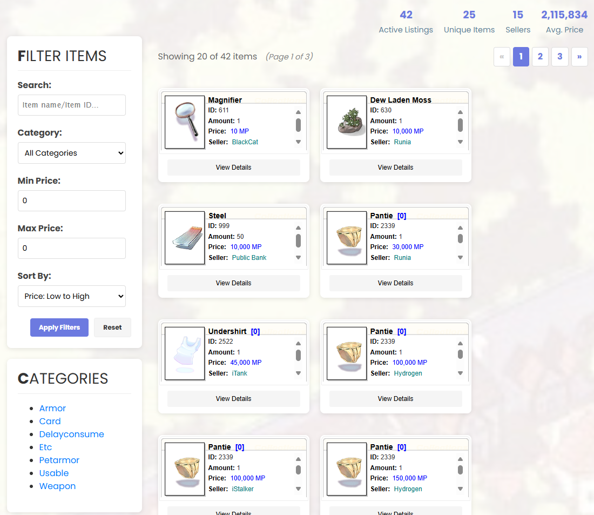
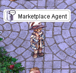

# Marketplace Guide

The Marketplace allows players to buy and sell items through the website while remaining offline in-game. This system ensures a fair and convenient economy where items can be listed, purchased, and retrieved without the need for an online vendor.

---

## 📍 Location
To interact with the Marketplace in-game, speak to the **Marketplace NPC** located at: /navi prontera 164/209

This NPC handles:
- Claiming purchased items  
- Collecting Zeny (converted as Market Points)  
- Reclaiming canceled or expired listings  

---

## 🛒 How to Sell Items

1. **Log into the website**  
   Go to [ValkariaRO Marketplace](https://valkariaro.com/?module=marketplace).  

2. **Click `Sell Item`**  
   Select the item you want to sell from your inventory storage.  

3. **Set Price**  
   - Prices are set in **Market Points (MP)**.  
   - **1 MP = 1 Zeny**  

4. **Confirm Listing**  
   Your item will now appear on the marketplace.  

   
!!! warning "Important Note on Bulk Selling"
    If you list more than **1 item** in a single sale, buyers **must purchase the entire stack**.  
    They cannot buy a smaller amount.  
    - Example: You want to list **10 Eluniums** and wanted to sell at **10,000 MP each** → You must set the price to **100, 000 MP** in total. Buyer only can buy **10 Elunium** in **1 transaction.**
    - Always set your total price carefully to reflect the full stack value.  
---

## 💰 How to Buy Items

1. Visit the [Marketplace page](https://valkariaro.com/?module=marketplace).  
2. Use filters to browse by **Item Type**, **Price Range**, or **Seller**.  
3. Click on an item and confirm the purchase.  
4. Collect your purchased item from the **Marketplace NPC** in Prontera.  

---

## 🔄 Claiming Items & Earnings

All marketplace transactions must be claimed at the **Marketplace NPC**:

- **If you sold an item** → Collect your Zeny (converted into MP).  
- **If you bought an item** → Collect your purchased goods.  
- **If a listing expired or was canceled** → Collect your item back.  

> 💡 **Tip:** Always check the NPC after making a transaction on the website.

---

## ⏳ Listing Duration

- Each item listing lasts for **14 days**.  
- If the item does not sell within this time, it will **expire**.  
- Expired items must be manually retrieved from the Marketplace NPC.  

---

## 📊 Marketplace Stats

The website displays real-time data about current activity:  
- **Active Listings**  
- **Unique Item Types**  
- **Number of Sellers**  
- **Average Market Price**  

This helps players understand supply, demand, and price trends.  

---

## ⚖️ Conversion Rules

- Zeny is converted into **Market Points (MP)** when deposited.  
- **1 Zeny = 1 MP**  
- All transactions on the website use MP.  
- MP is returned to players as Zeny through the NPC.  

---

## ❌ Canceling a Listing

1. Open the Marketplace website.  
2. Go to **My Listings**.  
3. Click **Cancel** on the item you no longer wish to sell.  
4. Return to the NPC in-game to reclaim your item.  

---

## ✅ Summary

- Use the **website** to list and browse items.  
- Use the **NPC in Prontera (164,209)** to claim, withdraw, or retrieve items and Zeny.  
- Listings last **14 days**.  
- Currency is handled in **Market Points (MP)**, equivalent to **Zeny**.  

The Marketplace system makes trading more efficient and ensures fair opportunities for buyers and sellers alike.  

---

!!! tip "Pro Tip"
    Use the Marketplace website to check for deals before hunting or farming items.  
    Sometimes buying from another player is cheaper than farming it yourself!
