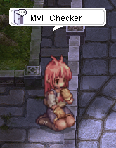
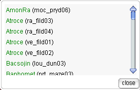

# 🧭 MVP Checker NPC

Never waste time wandering the MVP maps again — **the MVP Checker is here to help you hunt smarter, not harder!**

Our server provides a convenient **MVP Checker NPC** located right in Prontera. With just a quick chat, you can find out if your target MVP is currently **alive** or **has been defeated**.

---

## 📍 Where to Find the MVP Checker

Head over to the NPC in Prontera at:

📌 **Location:** `/navi prontera 149/164`

They’re easy to find and always ready to help you keep track of MVP spawn times and availability.

---

## 💡 How It Works

1. Walk up to the **MVP Checker NPC**.
2. Interact with them to choose from a list of available MVP bosses.
3. The NPC will tell you if the boss is currently **alive** on the map or **not yet respawned**.
4. Plan your next move with confidence!

---

## 🎯 Why Use the MVP Checker?

- Save time and avoid running in circles.
- Coordinate MVP hunts more effectively with your party.
- Be the first one there when the boss spawns.
- Increase your chances of getting rare drops!

Whether you're a seasoned MVP hunter or just starting out, this feature is a **must-have tool** to step up your boss-hunting game.

---

⚔️ **Happy hunting, champions of ValkariaRO!**
