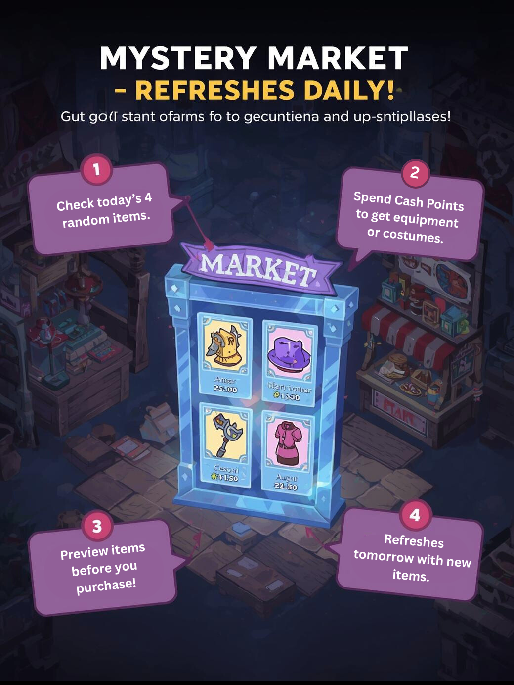

!!! Attention 
    This features is still under development. Will be released soon

# 🛍️ Mystery Market Guide

Welcome to the **Mystery Market** a special shop that refreshes daily with **unique offers** for every player!  
This system brings variety, excitement, and a chance to preview costumes and equipment before you buy them.

---

## ✨ How It Works

1. **Daily Refresh**  
    - Every day, the Mystery Market generates **4 random items** just for you.  
    - These offers are unique per player, so what you see may be different from your friends.

2. **Items Available**  
    - Only **Costumes** will appear.  
    - No consumables or one time use items.  
    - Each item comes with a set **Cash Points price**.

3. **Preview Before Purchase**  
     - Want to see how a costume or garment looks before buying?  
     - Use the built-in **Preview option** to try it on your character.  
     - Your appearance will return to normal after closing the preview.

4. **Purchasing Items**  
    - Spend your **Cash Points** to claim items.  
    - Unlimited Purchase
    - Once purchased, the item goes directly into your inventory.

5. **Daily Reset**  
    - The shop refreshes **once per day** (server time).  
    - Tomorrow, new items will appear!  
    - A server-wide announcement lets everyone know when the reset happens.

---

## 📌 Example Workflow

1. Visit the Mystery Market NPC.  
2. View today’s **4 unique offers**.  
3. Decide whether to **preview** or **purchase**.  
4. Items refresh the next day – so check back daily!  

---

## 🎭 Why Use the Mystery Market?

- Brings **fresh daily content** for every player.  
- Encourages **exploration of costumes and equipment**.  
- Fair system – everyone gets their own personal random set.  
- Fun, simple, and rewarding!

---

## 🏷️ Notes & Restrictions

- Each player’s offers are **different** and reset daily.   
- Cash Points are required for purchases.  
- Preview is only available for **Costumes and Equipment** that have a visible appearance.  

---

> ⚔️ Tip: Check the Mystery Market **every day** so you don’t miss out on rare costumes!
> If you'd like to preview the item, visit our Costume Page here.
