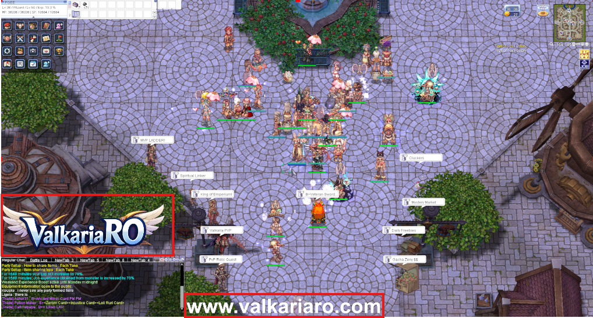

# 🎥 Streamer Package

!!! abstract "Become a ValkariaRO Creator"
    Ready to turn your gameplay into influence?

    ValkariaRO is opening the doors to **all streamers** who want to grow with us.  
    Whether you're just starting out or already building an audience, this is your chance to stream, earn rewards, and become part of something bigger.

    🎥 Stream your adventure  
    💎 Earn rewards based on hours  
    🚀 Unlock official Streamer Code opportunities  

    No follower requirement. No platform restriction.  
    Just stream, have fun, and help us grow the ValkariaRO world.

---

## 🚀 Program Overview

We are inviting content creators to help promote ValkariaRO.

You may stream on:

- 🎥 Facebook Gaming
- 🟣 Twitch
- ▶️ YouTube
- 🎵 TikTok
- Any other streaming platform

!!! info
    There is **no minimum follower requirement** to join.

---

## 📋 Participation Requirements

!!! warning "Mandatory Streaming Format"
    All participants must follow the official stream format.

### ✔ On-Screen Requirements

- ValkariaRO **Official Logo** must be visible at all times. You may grab the logo here. [Click Here](https://drive.google.com/drive/folders/1T8KMcLZrk5QICKOURpcBr_9JDCxBfQ-S?usp=sharing)

- The following text must be clearly displayed:

    `www.valkariaro.com`

- Stream title must include:

    `Playing ValkariaRO | Pre-Renewal 99/70`

- Below is the sample for your stream screen. Position for both logo and text is up to your likings.
  
    

- No toxic, racist, religious, or offensive commentary

Failure to follow the format may result in reward rejection.

---

## 🎟️ Reward Claim Process

=== "Step 1 – Start Stream"

    Immediately after starting your stream:

    - Create a Discord ticket
    - Provide:
        - Stream link
        - Platform name
        - In-game character name

=== "Step 2 – End Stream"

    After finishing your stream:

    - Reply to the same ticket
    - Provide:
        - Total streaming hours
        - Stream summary (what was done)
        - VOD link (if available)

=== "Step 3 – Review"

    - Valkaria Team reviews submission
    - Streaming hours are verified
    - Rewards are approved and distributed

---

## ⏱️ Streaming Reward Structure

!!! note
    Rewards are granted per approved streaming session.

| Hours Streamed | Tier | Reward (Placeholder) |
|----------------|------|----------------------|
| 2+ Hours    | 🥉 Tier 1 | 2 Hourly Points |
| 3+ Hours    | 🥈 Tier 2 | 4 Hourly Points |
| 5+ Hours    | 🥇 Tier 3 | 8 Hourly Points|
| 6+ Hours       | 💎 Tier 4 | 10 Hourly Points |

> Final reward details will be announced by the Valkaria Team.

---

## 💰 Streamer Code Program (To be announced soon)

Selected streamers may qualify for an **Official Streamer Code**.

### Benefits

- 5% commission from purchases using your code
- Special Discord role
- Featured recognition
- Collaboration opportunities

---

## 📊 Streamer Code Eligibility

To qualify:

- Consistent streaming activity
- Positive viewer engagement
- Professional stream quality
- No rule violations
- Genuine audience (no artificial boosting)

!!! success
    Streamer Code approval is reviewed manually by the Valkaria Team.

---

## 🚫 Disqualification Policy

You may be removed from the program if:

- Streaming format is not followed
- Fake viewers or artificial boosting is detected
- Toxic behavior is observed
- Misleading server promotion occurs

---

## 🎯 Program Objective

This program is designed to:

- Increase ValkariaRO visibility
- Support content creators
- Grow the community
- Create a win-win partnership model

---

## 🔥 Ready to Start?

1. Start streaming ValkariaRO
2. Open a Discord ticket
3. Submit your stream link
4. Earn rewards

Let’s grow ValkariaRO together.