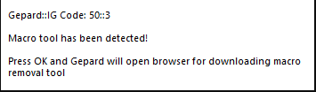
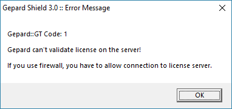

# Troubleshooting Guide

Welcome to the **ValRO Troubleshooting Hub**.  
If you’re having problems launching or running the client, this page covers the most common fixes.  
Follow the steps below depending on the issue you’re facing.

---

## 1. Getting Started

!!! tip "Always run as Administrator"
    Right–click and set the following files to **Run as Administrator**:
    
    - `ValRO.exe`
    - `Valkaria Patcher.exe`
    - `opensetup.exe`

!!! tip "Recommended setup"
    - Set **Compatibility Mode** of `ValRO.exe` to **Windows 7** (Win10/11 users) or **XP Service Pack 3**.  
    - Install the game in a custom folder (e.g. `C:\Games\ValRO\`) instead of `Program Files`.  
    - Update your client through **Valkaria Patcher.exe** regularly.  

---

## 2. Antivirus / Firewall Warnings

Some security software may **mistakenly flag ValRO files** because of our anti-cheat systems.

✅ **Fix**: Add the following as exceptions in your antivirus/firewall:  
- ValRO installation folder  
- `ValRO.exe`  
- `Valkaria Patcher.exe`  

!!! warning "Special note for Brazil"
    If you use **Warsaw Bank Security Software**, uninstall it before running ValRO.  
    This software conflicts with Gepard Shield and prevents the client from running.

---

## 3. Gepard Shield Errors

### 🚫 Stuck on loading screen
Open `opensetup.exe` and try:  
- Change **Resolution** or **Graphics Device**.  
- Uncheck **Play in Full Screen**.  
- Disable **Sound**.  
- Use **Delete all Ragnarok-related settings (factory reset)**.  

---

### 🚫 Error Code 50 – Illegal software detected

Some mouse/keyboard drivers or macro tools are blacklisted.  
Close them before launching ValRO.  
Whitelist updates are released often, so legit software may be approved later.

---

### 🚫 Error Code 1 – License validation failed

Check the following:  
- Stable **internet connection**.  
- Add **ValRO client folder** to antivirus/firewall exceptions.  

!!! info "SEA Players"
    Some ISPs block required ports by default.  
    - Allow **Port 6700**.  
    - Unblock these IPs:  
      - `185.61.138.117`  
      - `139.99.40.25`

---

## 4. Performance Issues (Low FPS / Freezes)

If you have **Nvidia graphics (Win10/11)** and the client lags/freezes:

1. Open **Nvidia Control Panel → Manage 3D Settings**.  
2. Add `ValRO.exe` and set:  
   - Max Frame Rate → **60 FPS**  
   - Monitor Technology → **Fixed Refresh**  
   - Preferred Refresh Rate → **Application-controlled**  
   - Vertical Sync → **Use the 3D-application setting**  

👉 Don’t see these options? Update your **Nvidia drivers** via **GeForce Experience** or [NVIDIA’s website](https://www.nvidia.com/).

---

## 5. D3D / GRF File Issues

If you see **“Cannot init d3d”** or **GRF file errors**:

- Run `opensetup.exe` as administrator.  
- In **Graphics API**, select **DirectX 7**.  
- Save settings and restart the client.  

---

## Final Notes
If your issue isn’t listed here, please reach out on the **[ValRO Support Discord](https://discord.gg/5sdvj8sPYg)** with:  
- A screenshot of the error  
- Your Windows version  
- Steps you already tried  

We’ll help you get back in game as quickly as possible! 🚀
