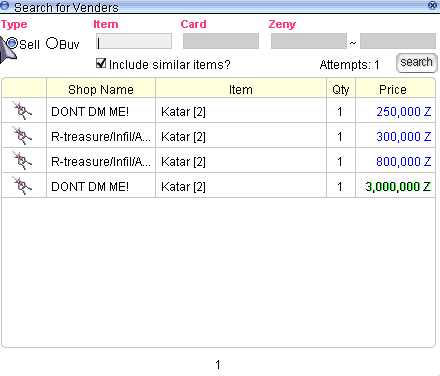

# 🛒 Vendor System Guide

Welcome to the **Vendor System** guide for **ValkariaRO**! This guide covers everything you need to know about setting up a shop, using vending commands, and buying items—either in person or remotely through the search store system.

---

## 📦 Overview

The vendor system is the backbone of the player-driven economy in **ValkariaRO**. Whether you’re looking to sell rare loot or stock up on supplies, vending makes it all possible.

- **📍 Vending Location:** `Alberta` (designated vending map)
- **💸 Currency Used:** Zeny
- **🏪 Vending Types:** Sell Shops and Buying Stores

Using the **Search Store** function, you can purchase items directly from a vendor’s shop window—no need to walk up to them in Alberta.

---

## 🔧 Available Commands

| Command                   | Description                                                                 |
|----------------------------|-----------------------------------------------------------------------------|
| `@autotrade` or `@at`     | Keeps your shop open while you're offline.                                 |
| `@searchstores` or `@ss`  | Opens the search window for all active shops on the server.                 |

> 💡 Vendors can be placed in **Prontera** our current main town. Vendor location will be moved to other town in future.

---

## 🛍️ How to Set Up a Sell Shop

1. Use a character with the **Vending** skill (usually a Merchant class).
2. Drag the vending skill to your hotkey bar or type `/vending`.
3. Set up your shop name, select the item(s) to sell, and assign prices.
4. Once your shop is open, type `@autotrade` or `@at` to safely log out while your shop stays active.

> ✅ Your shop will remain online until the server restarts or you manually log in again.

---

## 🛒 How to Use the Search Store Function

1. Type `@searchstores` or `@ss`.
2. A search window will appear. Enter the name of the item you want to find.
3. Untick *Include Similar Items?* for better search results.
4. Use full name for search eg: Red Potions, White Potions or use @ii to find correct item name

1. Browse results from all online vendors.
2. Click **Buy** to purchase the item instantly — no need to visit the vendor’s exact location. But you need to be in the same map as the vendor

> ⚡ This function streamlines your shopping experience and saves you valuable time.

---

## 🤝 Creating a Buying Store

Any player can set up a **Buying Store** to purchase items from others. Here are the requirements:

- **Have the Item Registered**: You must already possess at least one of the item you wish to buy.
- **Sufficient Zeny**: Make sure you have enough Zeny to pay for all the quantities you're requesting.
- **Adequate Weight Capacity**: Ensure your character can carry the purchased items.
- **Proper Location**: Buying Stores must only be set up in **authorized maps** like Alberta.

### 🧍 For Non-Merchant Classes:

If your character doesn’t belong to the Merchant class:

- Go to **Morroc Pub**
- Locate the **Black Marketeer**  
  → Use command: `/navi morocc 45/108`

The Black Marketeer allows any class to open a buying store with the same rules and requirements as Merchants.

---

## ⚠️ Vendor Rules

To maintain fairness and accessibility:

- ✅ Vendors and Buying Stores must be set up **only in Alberta**.
- ❌ Do **not block NPCs or warp portals** with your shop.
- ⛔ Abuse of vending or shop placement may result in removal by GMs.

---

Get ready to sell smart and shop easy with the vendor system on **ValkariaRO**! 🧺
